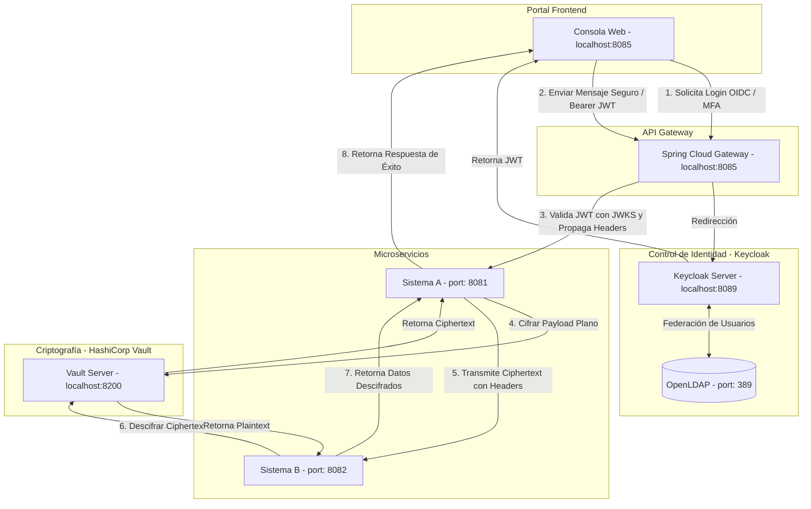

# Consola de Control Seguro — Integrador OIDC & KMS

Este proyecto implementa una arquitectura de integración segura entre dos sistemas web distribuidos (**Sistema A** y **Sistema B**), centralizando la gestión de identidades mediante **Keycloak** (federado con **OpenLDAP** y protegido con **MFA/TOTP**) y garantizando la confidencialidad de la comunicación a través de un servicio de gestión de llaves de terceros (**Vault KMS**).

---

## 🏗️ Arquitectura del Sistema



---

## 🛠️ Prerrequisitos

Para ejecutar y probar este proyecto necesitas tener instalado:
1. [Docker Desktop](https://www.docker.com/products/docker-desktop/) (debe estar iniciado y ejecutándose).
2. Una aplicación autenticadora en tu celular (ej. **Google Authenticator**, **Microsoft Authenticator** o **FreeOTP**).

---

## 🚀 Cómo Ejecutar el Proyecto

1. Abre una terminal (PowerShell o CMD) en la raíz del proyecto.
2. Limpia cualquier contenedor anterior y levanta la infraestructura ejecutando:
   ```bash
   docker compose down -v
   docker compose up --build -d
   ```
3. Espera aproximadamente **30-45 segundos** a que todos los servicios arranquen y compilen. Puedes verificar que todo esté arriba con:
   ```bash
   docker ps
   ```
   Deberías ver los siguientes contenedores activos:
   - `safe-gateway` (puerto `8085`)
   - `safe-keycloak` (puerto `8089`)
   - `safe-vault` (puerto `8200`)
   - `safe-openldap` (puerto `389`)
   - `safe-sistema-a`
   - `safe-sistema-b`

---

## 🧪 Guía Paso a Paso para Probar el Proyecto

### Paso 1: Acceso al Portal y Redirección OIDC
1. Abre tu navegador e ingresa a: **`http://localhost:8085`**
2. Verás que el API Gateway intercepta tu petición y te redirige automáticamente a la pantalla de inicio de sesión de **Keycloak** (IAM).

### Paso 2: Autenticación con Usuarios Federados (LDAP)
El sistema utiliza usuarios almacenados en **OpenLDAP** que Keycloak sincroniza en tiempo real. Utiliza las siguientes credenciales para probar los diferentes roles:

| Usuario | Contraseña | Rol Asignado | Permisos en KMS |
| :--- | :--- | :--- | :--- |
| **`admin`** | `admin1234` | **`ADMINISTRADOR`** | Acceso total (Cifrar en A, Descifrar en B) |
| **`bodeguero`** | `bodeguero1234` | **`BODEGUERO`** | Solo lectura en B (No puede cifrar en A) |
| **`chofer`** | `chofer1234` | **`CHOFER`** | Sin accesos (Acceso denegado en A y B) |

*Digita el usuario `admin` y la contraseña `admin1234` y haz clic en Log In.*

### Paso 3: Configuración de Segundo Factor (2FA / MFA)
1. Dado que es el primer inicio de sesión del usuario, Keycloak exigirá obligatoriamente configurar la autenticación de doble factor.
2. Abre la app autenticadora en tu celular (ej. **Google Authenticator**).
3. Escanea el **código QR** que aparece en la pantalla del navegador.
4. Introduce el código numérico de 6 dígitos generado en tu celular dentro de la casilla de Keycloak para confirmar el emparejamiento.
5. ¡Listo! Has accedido a la **Consola de Control Seguro**.

### Paso 4: Visualización del Dashboard y Token JWT
Una vez dentro del portal, observa el panel izquierdo:
* **Federación Activa**: Indica que el usuario proviene de *OpenLDAP*.
* **Segundo Factor (MFA)**: Indica que la sesión está protegida por *TOTP*.
* **Token JWT**: Verás una caja con un texto largo (el JSON Web Token firmado por Keycloak). Este token contiene la identidad del usuario y sus roles asignados (`ADMINISTRADOR`, `BODEGUERO`, etc.).

### Paso 5: Prueba del Flujo Criptográfico KMS (Camino Feliz - Rol Administrador)
1. En el panel derecho de la consola, verás un payload de ejemplo en formato JSON.
2. Haz clic en el botón **"Enviar Seguro (KMS Cifrado)"**.
3. Observa cómo el visualizador de flujo muestra el proceso en tiempo real:
   * **Paso 1**: Se envía el JSON plano al **Sistema A**.
   * **Paso 2**: El **Sistema A** invoca al KMS de Vault, cifra el mensaje y transmite el texto encriptado (que empieza con `vault:v1:...`) al **Sistema B** por red.
   * **Paso 3**: El **Sistema B** recibe la trama cifrada, llama a Vault para descifrarla, y responde con el JSON original decodificado de forma segura.

### Paso 6: Prueba de Autorización y Bloqueo (Rol Bodeguero / Chofer)
1. Haz clic en **"Cerrar Sesión"** en la parte superior derecha.
2. Serás redirigido a Keycloak. Inicia sesión ahora con el usuario **`bodeguero`** y la contraseña `bodeguero1234` (también te pedirá configurar su respectivo código QR MFA la primera vez).
3. Intenta presionar el botón **"Enviar Seguro (KMS Cifrado)"**.
4. **Resultado**: El sistema mostrará un error **`HTTP status 403`** (o Acceso Denegado). Esto ocurre porque el **Sistema A** detecta a través del token JWT que el rol es `BODEGUERO`, y su política de seguridad exige estrictamente el rol de `ADMINISTRADOR` para cifrar y transmitir datos.

---

## 🔍 Explicación de los Componentes (Bajo el Capó)

### 🛡️ API Gateway (`gateway`)
El Gateway actúa como el punto único de entrada de la aplicación.
* Utiliza [RouteValidator.java](file:///c:/Users/PC%20Master/OCTAVO%20SEMESTRE/SOFTWARE%20SEGURO/ProyectoFinal/gateway/src/main/java/com/tita/gateway/config/RouteValidator.java) para definir qué rutas son públicas (como los archivos HTML, CSS y JS del frontend) y cuáles requieren un token JWT.
* El [JwtAuthenticationFilter.java](file:///c:/Users/PC%20Master/OCTAVO%20SEMESTRE/SOFTWARE%20SEGURO/ProyectoFinal/gateway/src/main/java/com/tita/gateway/filter/JwtAuthenticationFilter.java) intercepta cada petición a los endpoints `/api/a/**` o `/api/b/**`, obtiene el token de la cabecera `Authorization: Bearer <token>`, descarga las claves públicas desde Keycloak (seleccionando la clave de firma `use: sig` mediante Jackson) y verifica la firma digital del token de forma asimétrica (RS256).
* Si el token es válido, extrae el correo electrónico y los roles del usuario, y los propaga hacia los microservicios usando cabeceras HTTP personalizadas: `X-User-Email` y `X-User-Rol`.

### 🏢 Sistema A (`sistema-a`)
* Recibe la petición del frontend en el endpoint `/api/a/enviar`.
* Valida que la cabecera `X-User-Rol` contenga el valor `ADMINISTRADOR`. Si no lo contiene, rechaza la petición con un error `403 Forbidden` inmediatamente.
* Codifica el payload plano en base64 y realiza una llamada REST interna a **Vault** (`/v1/transit/encrypt/tita-key`), el cual retorna la trama encriptada (ciphertext).
* Envía este texto cifrado por HTTP POST al **Sistema B**.

### 🏢 Sistema B (`sistema-b`)
* Recibe la petición cifrada del Sistema A en `/api/b/recibir`.
* Valida que la cabecera `X-User-Rol` sea `ADMINISTRADOR` o `BODEGUERO`.
* Realiza una llamada REST interna a **Vault** (`/v1/transit/decrypt/tita-key`), descifra la trama de vuelta a JSON plano y la retorna en la respuesta junto con el correo del usuario (`X-User-Email`) con fines de auditoría.

### 🔑 Vault KMS (`vault`)
* Actúa como el KMS del sistema. Está configurado para habilitar el motor de secretos `transit` y crea la clave criptográfica simétrica llamada `tita-key`.
* Almacena de forma segura la clave privada criptográfica; los microservicios nunca conocen la clave real, sino que delegan las operaciones criptográficas a la API de Vault, evitando fugas de llaves en los servidores de aplicación.
